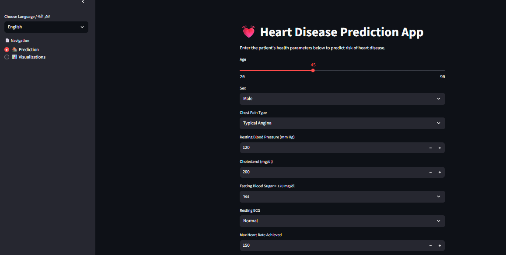
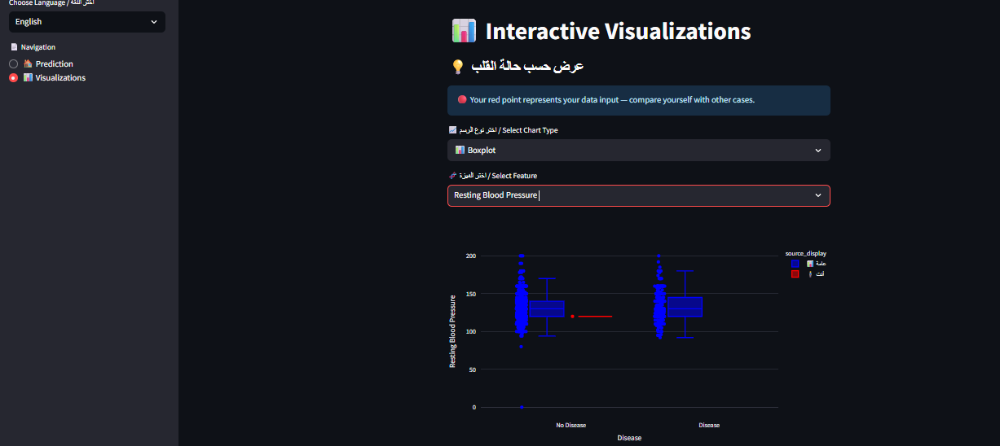

# heart-disease-streamlit
Machine learning app to predict heart disease using Streamlit and Scikit-learn
# 🫀 Heart Disease Prediction App (UCI Dataset)

[](https://www.python.org/)  
[](https://streamlit.io/)  
[](LICENSE)

---

## 📌 Project Overview

This project builds an **interactive Streamlit application** to predict heart disease using the UCI Heart Disease dataset.  
It includes data merging, preprocessing, model training, feature selection, visualization, and deployment via Ngrok.

<div align="center">
  
</div>

---

## 🎯 Motivation

Heart disease remains one of the top causes of mortality globally. This project:

- Empowers users with a quick risk check
- Helps non-technical users via a clean UI
- Visualizes how individual inputs compare to real cases

---

## 📊 Data Description

- **Source**: UCI Heart Disease Dataset  
- **Instances**: 920 (merged from 4 sources)  
- **Features**: 13 input variables  
- **Target**: Binary  
  - `0`: No heart disease  
  - `1`: Presence of heart disease  

---

## ⚙️ Preprocessing & Feature Engineering

- Combined multiple datasets (cleveland, hungarian, etc.)  
- Handled missing values using `median` and `mode`  
- Standardized numeric columns  
- Used One-Hot Encoding for categorical features  
- Performed PCA and Feature Selection  
- Applied multiple techniques: RFE, Random Forest Importance, Chi²

---

## 🤖 Modeling & Evaluation

| Model           | Accuracy | F1-score | AUC   |
|----------------|----------|----------|-------|
| **Random Forest** | 84%      | 85.8%    | 0.92  |
| SVM            | 84%      | 86.2%    | 0.91  |
| Logistic Reg.  | 81.5%    | 83.8%    | 0.90  |

Evaluation was done using:

- Accuracy, Precision, Recall, F1-score  
- ROC Curve & AUC Score

---

## 🧠 Unsupervised Learning

- ✅ **K-Means Clustering**  
- ✅ **Hierarchical Clustering (Dendrogram)**  
- Compared clusters with ground truth labels

---

## 🖼️ Prediction Output Examples

### 🔴 High Risk

<div align="center">
  
</div>

### 🟢 Low Risk

<div align="center">
  
</div>

---

## 📊 Visualizations

- Users can explore dataset insights interactively  
- Data is shown alongside user inputs (highlighted in red)

<div align="center">
  
</div>

---

## 🌐 Deployment (Local + Public Access)

- ✅ Built using [Streamlit](https://streamlit.io/)  
- ✅ Deployed via **[Ngrok](https://ngrok.com/)** for public sharing  
- Launch commands:
  ```bash
  streamlit run streamlit.py
  ngrok https://66a5e25aae2f.ngrok-free.app/
